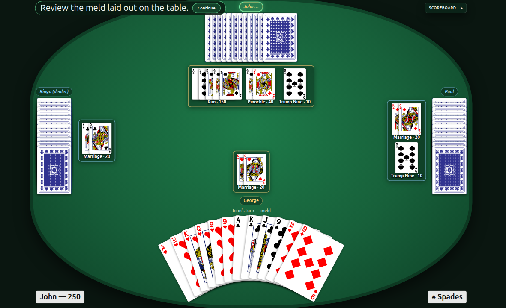

# pinochle

A four-player Pinochle game for the web: a Python server that owns every rule,
and a browser client per player that renders the table from that player's seat.



Rules: [Pinochle on Wikipedia](https://en.wikipedia.org/wiki/Pinochle).
Repository: [github.com/philhanna/pinochle](https://github.com/philhanna/pinochle).

## Running it

You need Python 3.12 or later, and Node.js (`make` compiles the TypeScript
front end with `npx`). First clone the repository, create a virtual
environment in `.venv`, activate it, and install:

**Linux and macOS**

```sh
git clone https://github.com/philhanna/pinochle.git
cd pinochle
python3 -m venv .venv
source .venv/bin/activate
pip install -e .          # everything, tests included
```

**Windows (PowerShell)**

```powershell
git clone https://github.com/philhanna/pinochle.git
cd pinochle
py -m venv .venv
.venv\Scripts\Activate.ps1
pip install -e .          # everything, tests included
```

In `cmd.exe`, activate with `.venv\Scripts\activate.bat` instead. If
PowerShell refuses to run the activation script, allow it once with
`Set-ExecutionPolicy -Scope CurrentUser RemoteSigned`.

Then start the server:

```sh
make dev                  # server on http://localhost:8000, admin token "dev"
```

The `make` targets need `make` and `bash`, which Linux has and macOS gets
with the Xcode command line tools (`xcode-select --install`). On Windows, run
them from WSL or Git Bash.

`make dev` prints a console link with the admin token already in it — open
that, create a game, and open each human seat's join link in **its own tab**:

```
console:        http://localhost:8000/admin?t=dev
```

Without the token in the URL the console asks for it, and it is whatever
`PINOCHLE_ADMIN_TOKEN` was set to (`make dev` uses `dev`), or the value the
server logs at startup if it was not set.

Then:

```sh
make seed                 # or: create a game from the command line instead
make seed-watch           # four computer players, nothing to join
make dev-fast             # like make dev, with every pause set to zero
make test                 # server and client tests
make test-browser         # plus: is every control actually clickable?
make docker               # the same thing as a container image
```

For Docker, first copy `.env.example` to `.env` and set a private
`PINOCHLE_ADMIN_TOKEN` and the players' `PINOCHLE_PUBLIC_BASE_URL`. The
container binds to `127.0.0.1:8000` by default; see
[Docker deployment](docs/docker-usage.md) for a reverse proxy or transferring
the image to another server.

A seat's join link is the only copy of its token, so keep it until the game
is over. A dropped connection reconnects by itself, and reopening the link —
after closing the tab, or in a second one — rejoins the seat: the server
replays what that seat missed.

Settings go in a `.env` file in this directory — copy `.env.example`, which
documents every key — or in the environment, which wins over the file.
`PINOCHLE_CARD_BACK` chooses the card back by the plain file name of an image
in `pinochle/card_images/backs/` (`castle`, `frog`, `red2`, …), and the
`PINOCHLE_TEAM_*` and `PINOCHLE_SEAT_*` keys pre-fill the console's setup form.

## How it is put together

Ports and adapters, with the server as the sole authority on state and rules:

- `pinochle/domain/` — cards, meld, tricks, scoring, the `Game` aggregate and
  its events. No web, no storage.
- `pinochle/ports/` and `pinochle/adapters/` — one abstract base class per
  port; in-memory state, SSE notification with replay, an asyncio scheduler,
  seat tokens, card artwork (`pinochle/card_images/`).
- `pinochle/services/` — the use cases, the round state machine, and the
  driver that plays the computer seats through the same ports a human client
  uses; `pinochle/strategies/` holds the computer's decisions.
- `pinochle/web/` — FastAPI. Actions are ordinary HTTP requests; state changes
  are pushed over Server-Sent Events, one stream per connection.
- `frontend/` — TypeScript compiled by `tsc` to ES modules the browser loads
  directly: the player's table and the admin console. No bundler and no
  runtime dependency.

## Documents

- `docs/requirements.md` — what the system must do. Authoritative.
- `docs/design.md` — how the code is built: ports, HTTP and SSE, the client.
- `docs/impl.md` — how it was built, slice by slice, and how each was checked.
- `docs/docker-usage.md` — running it in a container, and deploying it.
- `CHANGELOG.md` — what changed, and why.
